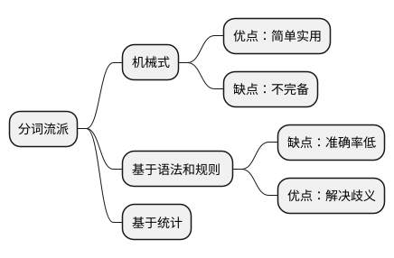
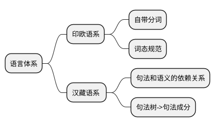
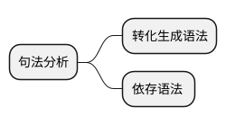

<backgroud>green</backgroud>
# NPL( nature process language 自然语言处理)
##分词
句子=可计算的逻辑表达式
why: 
 句子是一序列词组成。
 拉丁语系具有天然分词的属性。中文不具备。

NShort最短路径算法
### 未登录词识别（name entity recognition NER）
命名实体识别

1. 网络用语
2. 专业术语
  

算法： semi-CRF（半监督-条件随机场）:准确率高，耗能低

正则表达式式字符串集合的代数表达

## 句法分析

语法代表信心编码的结构
语法是为了表达语义

自下而上的句法分析

短语结构文法： 词汇、短语、小句和句子。

形式化：

