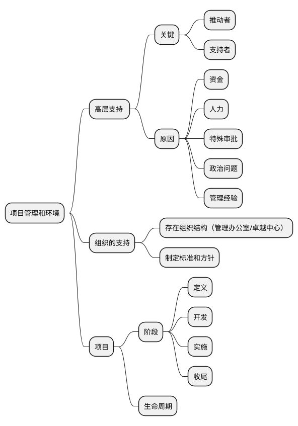

## PMP MindMap

```puml
@startmindmap
* 项目管理和环境
** 高层支持 
*** 关键
**** 推动者
**** 支持者
*** 原因
**** 资金
**** 人力
**** 特殊审批
**** 政治问题
**** 管理经验

** 组织的支持
*** 存在组织结构（管理办公室/卓越中心）
*** 制定标准和方针

** 项目
*** 阶段
**** 定义
**** 开发
**** 实施
**** 收尾
*** 生命周期
@endmindmap
```